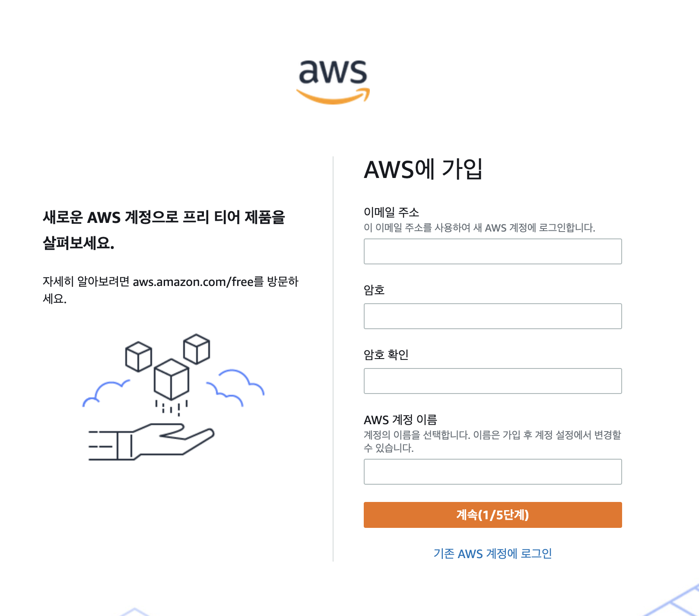
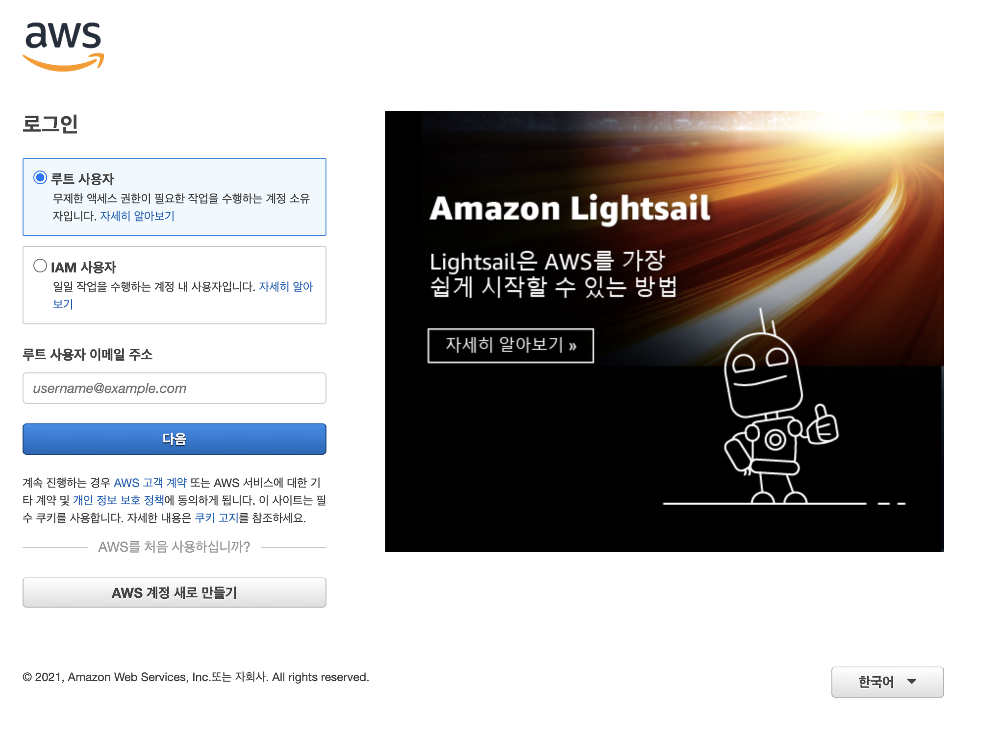
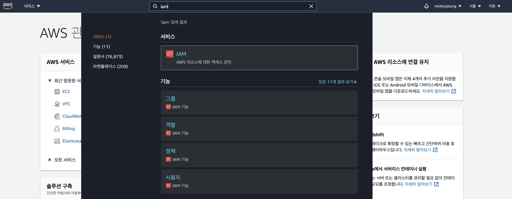
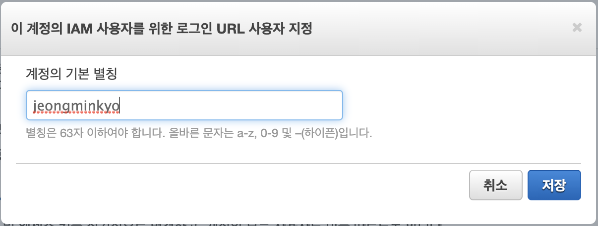
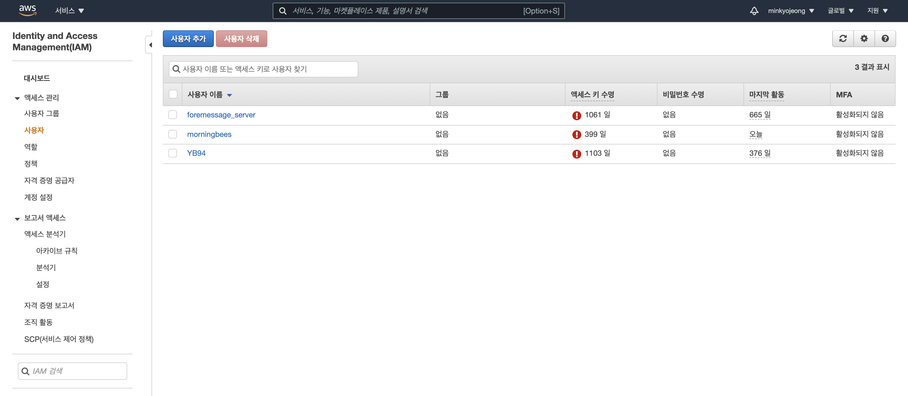
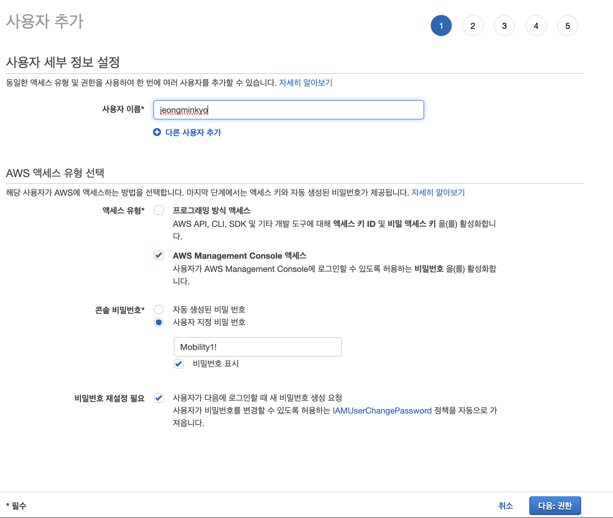
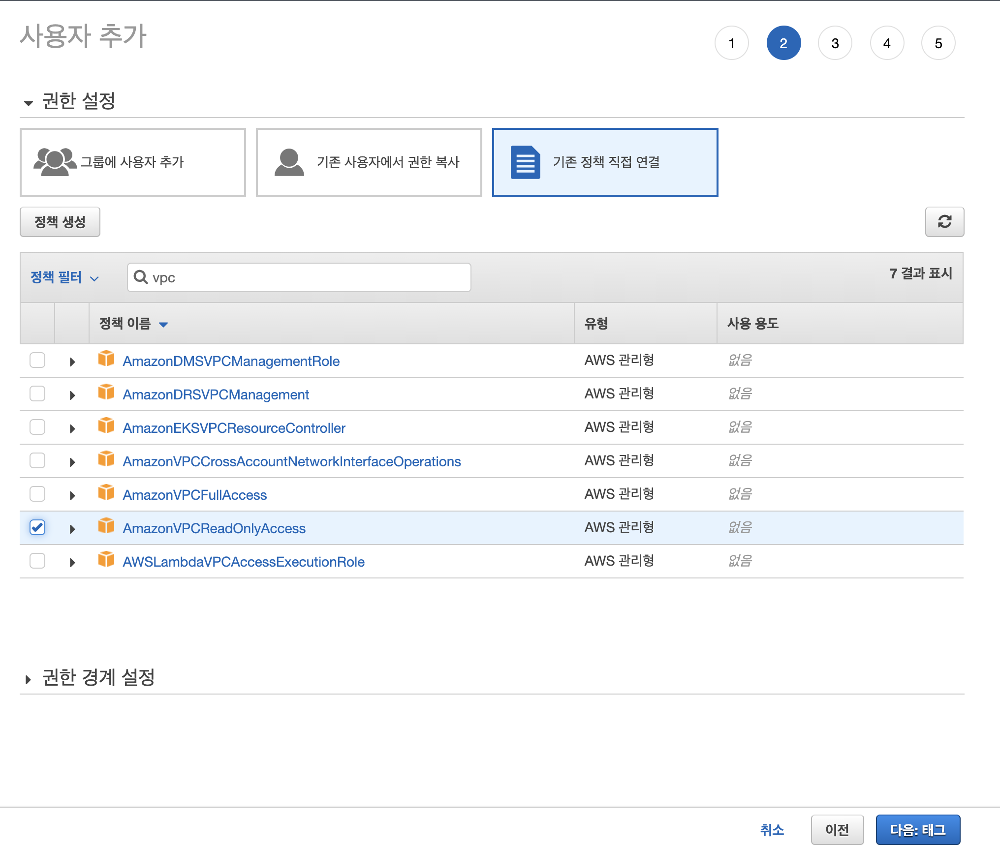
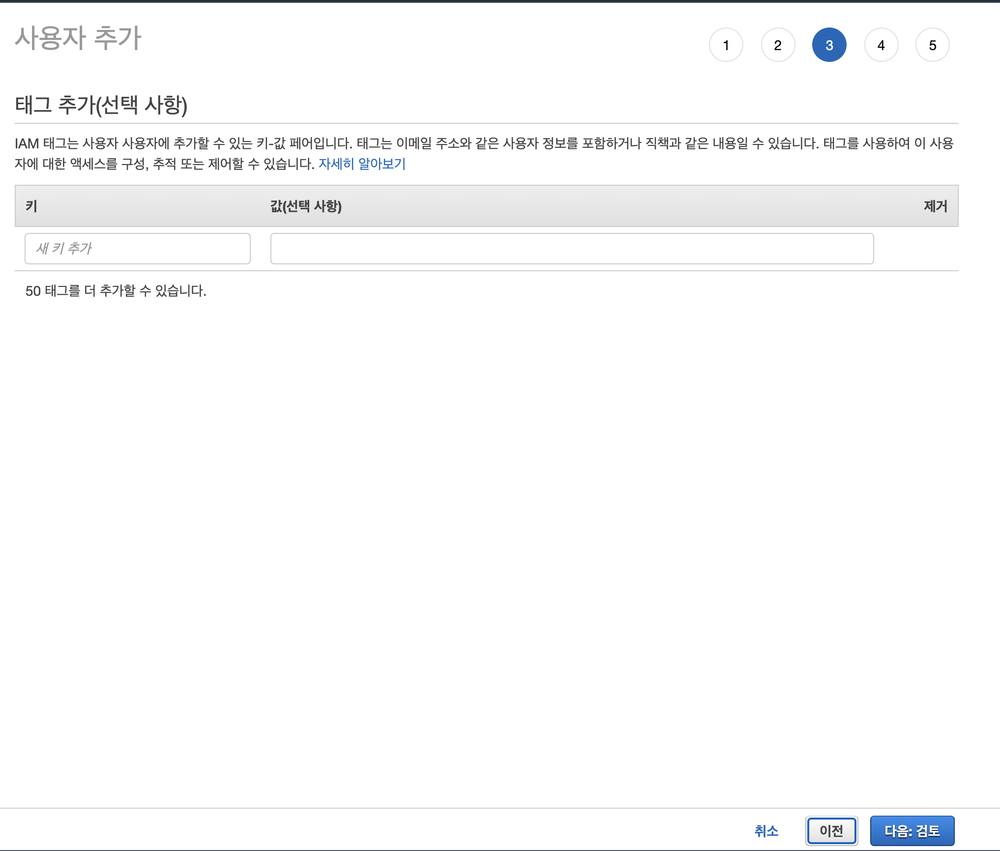
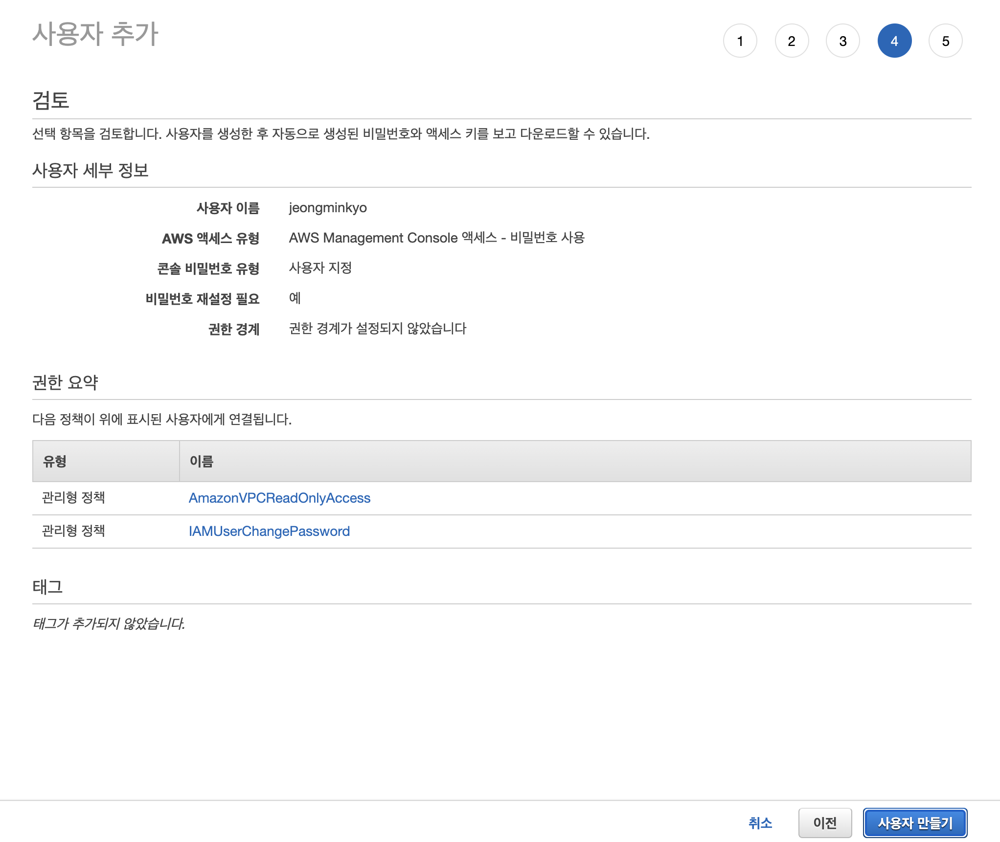
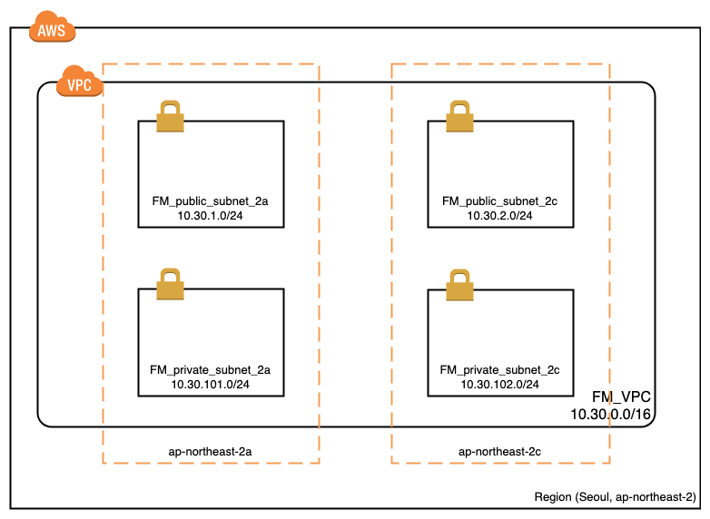

## AWS를 이용하여 서비스 구성하기 1주차

### DEVOPS, SRE(Site Reliability Engineer)

(sk플래닛 AWS 서비스 구성도)

https://www.wanted.co.kr/wd/65683(오늘의집 SRE / DevOps Engineer 채용 공고)

#### 직무 소개
 Site Reliability Engineering (사이트 안정성 엔지니어링)는 소프트웨어와 시스템 엔지니어링을 결합하여 large-scale, distributed, fault-tolerant systems 을 구축하고 실행하는 엔지니어링 분야입니다.
 Site Reliability Engineer (사이트 안정성 엔지니어, 이하 SRE) 는 서비스 (내부적으로 중요한 시스템과 외부에서 볼 수있는 시스템 모두)의 용량과 성능을 확인하면서 고객의 요구에 맞는 안정성과 가동 시간, 빠른 개선 속도를 갖도록 보장하는 업무를 수행합니다.
 일반적으로, SRE는 시스템이 서로 어떻게 관련되어 있는지에 대한 큰 그림을 분석합니다. 운영 작업, 장애 이후 사후 분석 작업, 장애가 발생할 수 있는 부분 등을 미리 판단하기 위해 작업 중단, 장애 주입, 스트레스 테스트 등과 같은 여러 실험들을 기본적으로 수행합니다.
 이러한 작업 외에도 SRE 직무에는 실무 기술 작업과 함께 전략적 엔지니어링 및 설계가 혼합되어 있습니다.
 저희가 생각하는 이상적인 후보자는 시스템 엔지니어, 개발자, 또는 시스템 관리자 등의 경력에서 시작하여 DevOps / Automation 등으로 career path를 확장하려는 분이며, Automation, Microservice 구축을 위한 tools 및 coding 기술이 필요합니다.
 특히, SRE는 소프트웨어 엔지니어 및 서비스 개발자와 긴밀히 협력하여 서비스를 배포하고 유지 관리합니다.

#### 주요업무

SRE는 배포, 운영 및 개선을 통해 시작 및 설계부터 서비스의 전체 라이프 사이클에 참여하고 개선합니다.

• 시스템 설계와 같은 활동을 통해 서비스가 시작되기 전에 지원 서비스 컨설팅, 소프트웨어 플랫폼 및 프레임워크 개발, 용량 계획 및 리뷰를 합니다.
• 서비스가 활성화되면 유지 관리, 가용성, 대기 시간 및 전반적인 시스템 상태 등을 측정 및 모니터링 합니다. 
• 자동화와 같은 메커니즘을 통해 지속 가능한 방식으로 시스템 확장 및 발전시킵니다. 그러면서도 시스템의 안정성과 속도를 향상시키는 변화를 추진합니다.
• 지속 가능한 사고 대응 및 무결점 사후 분석을 교육하고 실행합니다.
• 시스템 가용성 사고에 대응하기 위해 on-call을 하고 서비스 장애 발생 시 서비스 개발자를 지원합니다.
• 중단이 아닌 증상에 대해 모니터링 및 경고를 보냅니다.
• 확장 할 수 있는 핵심 인프라 부분을 설계, 구축 및 유지합니다. 
• 엔지니어에게 프로덕션 문제에 접근하고 디버깅하는 방법을 교육합니다.
• 잠재적인 중단을 식별하기 위해 의도적으로 작업을 중단하거나 장애를 주입합니다.

#### 회사에서 진행할 프로젝트
\- Kubernetes 및 AWS SDK (Go / Python / Java)로 인프라 자동화 코딩
\- Prometheus를 통한 모니터링 개선 또는 새로운 지표 구축
\- CI / CD 지원 및 새 버전의 플랫폼 수정
\- 프로덕트 개발 시 오류를 방지하고 카오스 엔지니어링 프랙티스를 통하여 오늘의집 플랫폼의 복원력과 신뢰성을 테스트할 수 있는 방안 도출
\- 인프라 및 플랫폼 보안 수준 향상 및 보안 모니터링 구축

### On-premise vs cloud 

#### - on premise

온프레미스(On-premise)란

 소프트웨어 등 솔루션을 클라우드 같이 원격 환경이 아닌 자체적으로 보유한 전산실 서버에 직접 설치해 운영하는 방식을 말합니다.

장점

- 인터넷 전용회선 요금기준으로 적용하며 트래픽 증가시 별도 요금 발생하지 않음
- 기업의 비즈니스 정보를 보안성 높게 관리할 수 있음

단점

- 일회성 비용으로 구매시 많은 비용예산이 소요됨(높은 초기 투자 비용)
- 시스템 엔지니어의 업무 증대(서버 운영 및 관리 / 전산실 유지관리 등)
- 최대용량을 산정하여 시스템 설계가 이루어져 자원 낭비요소가 있음(한정된 용량)
- 구축기간이 오래걸림
- 클라우드에 비해 확장성이 느림
- 현지 규정, 국제 규정 등 규정 준수에 큰 비용이 들 수 있음

#### - clould

cloud란

사용자의 직접적인 활발한 관리 없이 특히, 데이터 스토리지([클라우드 스토리지](https://ko.wikipedia.org/wiki/클라우드_스토리지))와 [컴퓨팅 파워](https://ko.wikipedia.org/wiki/컴퓨터_성능)와 같은 [컴퓨터](https://ko.wikipedia.org/wiki/컴퓨터) [시스템 리소스](https://ko.wikipedia.org/w/index.php?title=시스템_리소스&action=edit&redlink=1)를 필요 시 바로 제공(on-demand availability)하는 것을 말합니다.

장점

- 월정액 기반으로 사용한 만큼 요금을 지불
- 시스템 엔지니어의 업무 감소
- 시스템 설계시 서버사양을 과도하게 설정할 필요없이 운영상에 맞게 시스템 증설이 가능함(유연한 용량)
- 구축기간이 짧음
- 원하는 만큼 예산상황에 맞게 쉽게 시스템 증설이 가능
- 다른 컴퓨터로 즉시 이주(migration) 가능

단점

- 기존 방식 보다 보안에 취약함
- 트래픽에 기준이상 초과시 요금 부과
- 운영환경이 외부에 종속되기 때문에, 클라우드 서비스에 문제발생시 내 어플리케이션에까지 영향이 미침

### 클라우드를 사용하는 이유

일반적으로 서비스를 구성하고 운영을 할 때에는 3가지를 고민하게 된다.

1. 데이터를 어떻게 관리할 것인가 
   - 데이터 백업
   - 보안 이슈
   - 이중화 구성

2. 서버를 어떻게 관리할 것인가 
   - 서버 장비관리, OS 설치 
   - 배포 구성

3. 네트워크를 어떻게 관리할 것인가
   - 네트워크 장비 관리
   - 보안 구성, DDOS

클라우드를 이용하면 이러한 관리 포인트들을 클라우드에 위임을 하고, 핵심 가치에 집중할 수 있도록 도와준다.

### VPC란

VPC(Virtual Private Cloud) 서비스는 AWS 사용자가 직접 가상 네트워크 환경을 구성하는 서비스이다.VPC 를 디자인 하기 위해서는 먼저 Region 과 Availability Zone 에 대한 개념을 이해해야 한다.

AWS 서비스의 가장 큰 단위는 Region이다. Region이란 AWS의 서비스가 위치한 지리적인 장소이며, 글로벌 기준으로 지역적 위치를 묶어서 관리하는 단위이다.

하나의 Region 안에는 다수의 Availability Zone 으로 구성되어 있다.Availability Zone(이하 AZ) 이란 Region 내에 실제 컴퓨팅 리소스들이 물리적으로 분리되어 있는 단위이다.

그렇다면, AZ간 물리적으로 떨어져 있음으로 인해 생기는 latency는 어떠할까.

AWS 측에서는 같은 Region 내 AZ간에는 low-latency link 로 연결되어 있기 때문에 물리적으로 떨어져 있음으로 생기는 latency 에 대해 보장해준다.

VPC를 생성할때는 반드시 Region을 지정해야 한다. 즉, VPC는 반드시 하나의 Region에 속하게 된다. 또한 VPC는 Region내 다수의 AZ를 이용해 설계가 가능하다. 만약 **VPC 를 디자인 할때 Multi AZ를 기반으로 구성한다면, 사용자는 물리적으로 다수의 데이터센터를 이용하는 것과 같은 효과를 볼 수 있다.**

AWS에서의 망 

* Region : 국가 / 지역 

* Availability Zone : 데이터센터 

  * ap-northeast-2a 
  *  ap-northeast-2b 

* VPC 

  * 하나의 Region에 종속 
  * 다수의 AZ 설정 가능 
  * VPC IP 대역 내에서 망 구성

  

### Subnet 이란

VPC에는 Subnet 이라는 개념이 있는데, 흔히 알고 있는 대로 IP block을 구분짓는 그 Subnet과 동일하다.

Subnet의 특징은 반드시 하나의 AZ 에 속해야 한다는 것이다. 그렇기 때문에 VPC 내부에 다수의 Subnet 을 생성하여 각각의 AZ에 분산 배치 하면 아래와 같이 하나의 VPC에 Multi AZ 를 사용하도록 디자인 가능하다.

### ROUTE TABLE

라우트 테이블은 ip address에 routing 경로를 정의하여 subnet에서 밖으로 나가는 outbound traffic에 대한 routing 경로를 설정하는 것이다. 

라우팅 테이블에는 네트워크 트래픽을 전달할 위치를 결정하는 데 사용되는 라우팅이라는 규칙 집합이 포함되어 있고, VPC의 각 서브넷을 라우팅 테이블에 연결해야 한다. 테이블에서는 서브넷에 대한 라우팅을 제어한다. 서브넷을 한 번에 하나의 라우팅 테이블에만 연결할 수 있지만, 여러 서브넷을 동일한 라우팅 테이블에 연결할 수 있다.

### Internet Gateway

VPC 를 생성하면 모든 network가 private IP로 설정되어 있기 때문에 기본적으로 외부 통신과 단절된 상태로 생성된다.이때 외부로 통신하기 위해 Internet Gateway를 이용해 통신하도록 한다.

### NAT(Network Address Translation)

네트워크 주소 변환(Network Address Translation, 줄여서 NAT)은 IP 패킷의 TCP/UDP 포트 숫자와 소스 및 목적지의 IP 주소 등을 재기록하면서 라우터를 통해 네트워크 트래픽을 주고 받는 기술을 말한다.

NAT 디바이스를 사용하여 프라이빗 서브넷의 인스턴스를 인터넷(예: 소프트웨어 업데이트용) 또는 기타 AWS 서비스에 연결하는 한편, 인터넷에서 해당 인스턴스와의 연결을 시작하지 못하도록 할 수 있다. NAT 디바이스는 프라이빗 서브넷의 인스턴스에서 인터넷 또는 기타 AWS 서비스로 트래픽을 전달한 다음 인스턴스에 응답을 다시 보낸다. 트래픽이 인터넷으로 이동하면 소스 IPv4 주소가 NAT 디바이스의 주소로 대체되고, 이와 마찬가지로 응답 트래픽이 해당 인스턴스로 이동하면 NAT 디바이스에서 주소를 해당 인스턴스의 프라이빗 IPv4 주소로 다시 변환한다.

##### NAT 생성 방법

- NAT gateway
- NAT instance

##### NAT gateway와 instance의 비교

https://docs.aws.amazon.com/ko_kr/vpc/latest/userguide/vpc-nat-comparison.html

### Security Group

Security Group은 인스턴스에 대한 inbound 와 outbound 트래픽을 제어하는 방화벽 역할을 한다.

##### Security Group의 특징

- Security Group은 instance 단위로 적용 시킬 수 있다.
- 동일 Subnet 내에서 통신일 경우, ACL 규칙과 상관없이 Security Group 의 규칙을 적용 받게 된다.
- Security Group의 규칙은 Allow 지정 방식이며, Deny 지정은 불가하다.
- 기본적으로 Inbound 트래픽의 경우 All Deny 이다.
- Outbound 트래픽의 경우 기본적으로 All Allow 상태이며, All Allow 규칙은 삭제가 가능하고 원하는 Allow 규칙만 추가 가능하다.
- Security Group은 Stateful 하기 때문에 허용된 inbound 트래픽에 대한 응답은 outbound 규칙에 관계없이 허용된다.

### 왜 VPC를 설정해야 하나요?

VPC를 이용하면 Public / Private network 환경을 사용자가 원하는대로 디자인하고 구축할 수 있게 되며, 다양한 부가 기능을 통해 VPC 환경 내 네트워크 흐름을 제어할 수 있다. 개인 정보를 다루는 DB 서버 등을 위한 내부망, 사용자가 접근하는 웹 서버를 위한 외부망을 구성할 수 있다.

### 접근통제

가령, 우리가 터미널에 접속하기 위해 사용하는 22번 포트를 한번 생각해보면, **22번 포트의 경우 보안이 뚫린다면 서비스에 심각한 문제**를 일으킬 수 있다. 그렇다고, 모든 서버에 동일 수준의 보안을 설정하고자 한다면, Auto-Scaling 등 확장성을 고려한 구성과 배치된다. 이 경우 관리 포인트가 늘어나기에 일반적으로는 보안 설정을 일정 부분을 포기하는 결정을 하게 된다. 만약 Bastion Server가 있다면, 악성 루트킷, 랜섬웨어 등으로 피해를 보더라도 Bastion Server만 재구성하면 되므로, 서비스에 영향을 최소화할 수 있다.
추가적으로, **서비스 정상 트래픽과 관리자용 트래픽을 구분**할 수 있다는 이점이 있다. 가령, 서비스가 DDos 공격을 받아 대역폭을 모두 차지하고 있다면 일반적인 방법으로 서비스용 서버에 접속하기는 어렵기 때문에 별도의 경로를 확보해둘 필요가 있다.

따라서, 22번 Port 접속을 Bastion 서버에 오픈하고 그 서버에 보안을 집중하는 것이 효율적이다.

### 들어가기 전에

1. aws 계정 생성하기 

   

2. 계정에 IAM 계정 생성하기

   

   

   IAM 검색 후, 서비스 클릭

   

   

   이 계정의 IAM 사용자를 위한 로그인 URL에 별칭 등록 버튼 클릭

   

   

   

   

   사용자 추가 클릭

   

   

   

   기존 정책 직접 연결 클릭 후, vpc로 검색하면 나오는 AmazonVPCReadOnlyAccess 권한 클릭

   

   

   

3. 계정 비용 알림 설정

   https://brunch.co.kr/@topasvga/96

### 1주차 과제

---------

### 망 구성

- VPC 생성
  - CIDR은 B class(x.x.x.x/16)로 생성.
- Subnet 생성
  - 외부망으로 사용할 Subnet : 256개씩 2개 (AZ를 다르게 구성)
  - 내부망으로 사용할 Subnet : 256개씩 2개  (AZ를 다르게 구성)
  - 관리용으로 사용할 Subnet : 256개씩 1개
- Internet Gateway 연결
- Route Table 생성
- Security Group 설정
  - 외부망
    - 전체 대역 : 8080 포트 오픈
    - 관리망 : 22번 포트 오픈
  - 내부망
    - 외부망 : 3306 포트 오픈
    - 관리망 : 22번 포트 오픈
  - 관리망
    - 자신의 공인 IP : 22번 포트 오픈

- slack에 #summer-coding-aws 채널에 IAM 사용자를 위한 로그인 URL을 올려주면 리뷰.

- 자신이 구성한 서비스 구성도를 그려서 slack 채널에 올리기.

