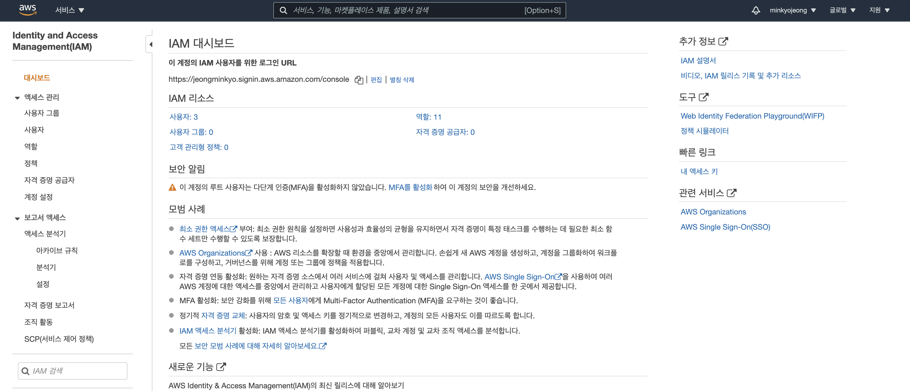

## AWS를 이용하여 서비스 구성하기 1주차

### DEVOPS, SRE(Site Reliability Engineer)

(sk플래닛 AWS 서비스 구성도)

https://www.wanted.co.kr/wd/65683(오늘의집 SRE / DevOps Engineer 채용 공고)

#### 직무 소개
 Site Reliability Engineering (사이트 안정성 엔지니어링)는 소프트웨어와 시스템 엔지니어링을 결합하여 large-scale, distributed, fault-tolerant systems 을 구축하고 실행하는 엔지니어링 분야입니다.
 Site Reliability Engineer (사이트 안정성 엔지니어, 이하 SRE) 는 서비스 (내부적으로 중요한 시스템과 외부에서 볼 수있는 시스템 모두)의 용량과 성능을 확인하면서 고객의 요구에 맞는 안정성과 가동 시간, 빠른 개선 속도를 갖도록 보장하는 업무를 수행합니다.
 일반적으로, SRE는 시스템이 서로 어떻게 관련되어 있는지에 대한 큰 그림을 분석합니다. 운영 작업, 장애 이후 사후 분석 작업, 장애가 발생할 수 있는 부분 등을 미리 판단하기 위해 작업 중단, 장애 주입, 스트레스 테스트 등과 같은 여러 실험들을 기본적으로 수행합니다.
 이러한 작업 외에도 SRE 직무에는 실무 기술 작업과 함께 전략적 엔지니어링 및 설계가 혼합되어 있습니다.
 저희가 생각하는 이상적인 후보자는 시스템 엔지니어, 개발자, 또는 시스템 관리자 등의 경력에서 시작하여 DevOps / Automation 등으로 career path를 확장하려는 분이며, Automation, Microservice 구축을 위한 tools 및 coding 기술이 필요합니다.
 특히, SRE는 소프트웨어 엔지니어 및 서비스 개발자와 긴밀히 협력하여 서비스를 배포하고 유지 관리합니다.

#### 주요업무

SRE는 배포, 운영 및 개선을 통해 시작 및 설계부터 서비스의 전체 라이프 사이클에 참여하고 개선합니다.

• 시스템 설계와 같은 활동을 통해 서비스가 시작되기 전에 지원 서비스 컨설팅, 소프트웨어 플랫폼 및 프레임워크 개발, 용량 계획 및 리뷰를 합니다.
• 서비스가 활성화되면 유지 관리, 가용성, 대기 시간 및 전반적인 시스템 상태 등을 측정 및 모니터링 합니다. 
• 자동화와 같은 메커니즘을 통해 지속 가능한 방식으로 시스템 확장 및 발전시킵니다. 그러면서도 시스템의 안정성과 속도를 향상시키는 변화를 추진합니다.
• 지속 가능한 사고 대응 및 무결점 사후 분석을 교육하고 실행합니다.
• 시스템 가용성 사고에 대응하기 위해 on-call을 하고 서비스 장애 발생 시 서비스 개발자를 지원합니다.
• 중단이 아닌 증상에 대해 모니터링 및 경고를 보냅니다.
• 확장 할 수 있는 핵심 인프라 부분을 설계, 구축 및 유지합니다. 
• 엔지니어에게 프로덕션 문제에 접근하고 디버깅하는 방법을 교육합니다.
• 잠재적인 중단을 식별하기 위해 의도적으로 작업을 중단하거나 장애를 주입합니다.

#### 회사에서 진행할 프로젝트
\- Kubernetes 및 AWS SDK (Go / Python / Java)로 인프라 자동화 코딩
\- Prometheus를 통한 모니터링 개선 또는 새로운 지표 구축
\- CI / CD 지원 및 새 버전의 플랫폼 수정
\- 프로덕트 개발 시 오류를 방지하고 카오스 엔지니어링 프랙티스를 통하여 오늘의집 플랫폼의 복원력과 신뢰성을 테스트할 수 있는 방안 도출
\- 인프라 및 플랫폼 보안 수준 향상 및 보안 모니터링 구축

### On-premise vs cloud 

#### - on premise

온프레미스(On-premise)란

 소프트웨어 등 솔루션을 클라우드 같이 원격 환경이 아닌 자체적으로 보유한 전산실 서버에 직접 설치해 운영하는 방식을 말합니다.

장점

단점

#### - clould

cloud란

사용자의 직접적인 활발한 관리 없이 특히, 데이터 스토리지([클라우드 스토리지](https://ko.wikipedia.org/wiki/클라우드_스토리지))와 [컴퓨팅 파워](https://ko.wikipedia.org/wiki/컴퓨터_성능)와 같은 [컴퓨터](https://ko.wikipedia.org/wiki/컴퓨터) [시스템 리소스](https://ko.wikipedia.org/w/index.php?title=시스템_리소스&action=edit&redlink=1)를 필요 시 바로 제공(on-demand availability)하는 것을 말합니다.

장점

단점

### 클라우드를 사용하는 이유

데이터를 어떻게 관리할 것인가 

서버를 어떻게 관리할 것인가 

네트워크를 어떻게 관리할 것인가

### 왜 VPC를 설정해야 하나요?

- 개인 정보를 다루는 DB 서버 등을 위한 내부망, 사용자가 접근하는 웹 서버를 위한 외부망을 구성

AWS에서의 망 

* Region : 국가 / 지역 
* Availability Zone : 데이터센터 
  * ap-northeast-2a 
  *  ap-northeast-2b 
* VPC 
  * 하나의 Region에 종속 
  * 다수의 AZ 설정 가능 
  * VPC IP 대역 내에서 망 구성

인터넷 통신 aa:bb:cc:11:22:34 aa:bb:cc:11:22:33 aa:bb:cc:11:22:35 * 외부 네트워크와 통신하기 위해서는 Public IP가 있어야 함 * 라우터는 Private IP가 목적지일 경우 인터넷 구간으로 보내지 않음 따라서, Private IP를 Public IP로 변환해주어야 함(NAT) * 자신이 속한 subnet(172.16.0.0/24)의 서버는 가상 스위치를 통해 직접 통신 * 자신이 속하지 않은 subnet(172.16.1.0/24)은 가상 라우터를 통해 직접 통신 * 그 외의 0.0.0.0/0 (전체 대역)은 Internet Gateway로 통신을 보내도록 학습

### 접근통제

가령, 우리가 터미널에 접속하기 위해 사용하는 22번 포트를 한번 생각해보면, **22번 포트의 경우 보안이 뚫린다면 서비스에 심각한 문제**를 일으킬 수 있습니다. 그렇다고, 모든 서버에 동일 수준의 보안을 설정하고자 한다면, Auto-Scaling 등 확장성을 고려한 구성과 배치됩니다. 이 경우 관리 포인트가 늘어나기에 일반적으로는 보안 설정을 일정 부분을 포기하는 결정을 하게 됩니다. 만약 Bastion Server가 있다면, 악성 루트킷, 랜섬웨어 등으로 피해를 보더라도 Bastion Server만 재구성하면 되므로, 서비스에 영향을 최소화할 수 있습니다.
추가적으로, **서비스 정상 트래픽과 관리자용 트래픽을 구분**할 수 있다는 이점이 있습니다. 가령, 서비스가 DDos 공격을 받아 대역폭을 모두 차지하고 있다면 일반적인 방법으로 서비스용 서버에 접속하기는 어렵기 때문에 별도의 경로를 확보해둘 필요가 있습니다.

따라서, 22번 Port 접속을 Bastion 서버에 오픈하고 그 서버에 보안을 집중하는 것이 효율적입니다.

### 들어가기 전에

1. aws 계정 생성하기 

   

2. 계정에 IAM 계정 생성하기

   

   

   IAM 검색 후, 서비스 클릭

   

   

   이 계정의 IAM 사용자를 위한 로그인 URL에 별칭 등록 버튼 클릭

   

   

   

   

   사용자 추가 클릭

   

   

   

   기존 정책 직접 연결 클릭 후, vpc로 검색하면 나오는 AmazonVPCReadOnlyAccess 권한 클릭

   

   

   

3. 계정 비용 알림 설정

   https://brunch.co.kr/@topasvga/96

### 1주차 과제

---------

### 망 구성

- VPC 생성
  - CIDR은 B class(x.x.x.x/16)로 생성.
- Subnet 생성
  - 외부망으로 사용할 Subnet : 256개씩 2개 (AZ를 다르게 구성)
  - 내부망으로 사용할 Subnet : 256개씩 2개  (AZ를 다르게 구성)
  - 관리용으로 사용할 Subnet : 256개씩 1개
- Internet Gateway 연결
- Route Table 생성
- Security Group 설정
  - 외부망
    - 전체 대역 : 8080 포트 오픈
    - 관리망 : 22번 포트 오픈
  - 내부망
    - 외부망 : 3306 포트 오픈
    - 관리망 : 22번 포트 오픈
  - 관리망
    - 자신의 공인 IP : 22번 포트 오픈

- slack에 #summer-coding-aws 채널에 IAM 사용자를 위한 로그인 URL을 올려주면 리뷰.

- 자신이 구성한 서비스 구성도를 그려서 slack 채널에 올리기.

