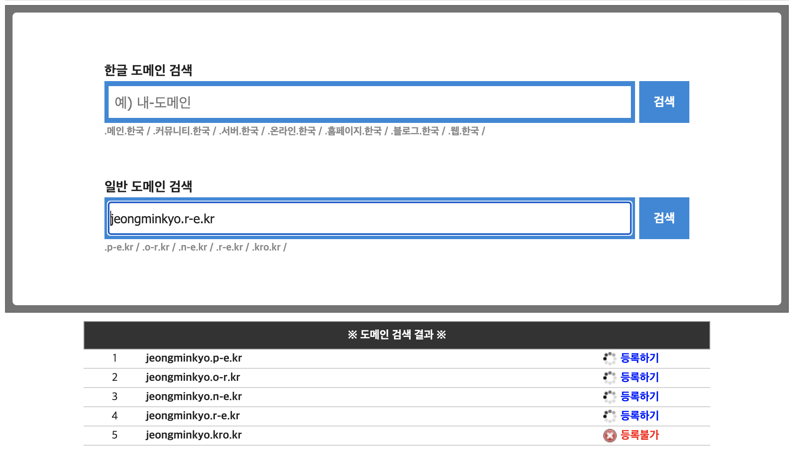
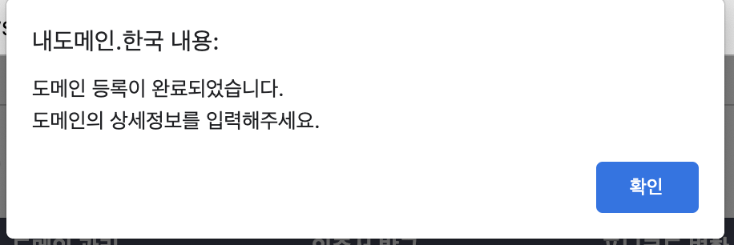
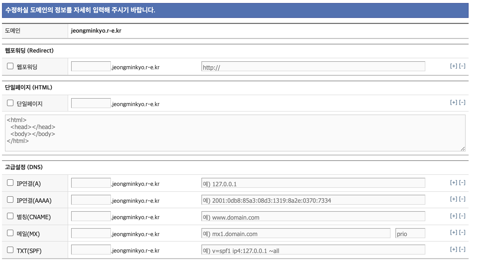
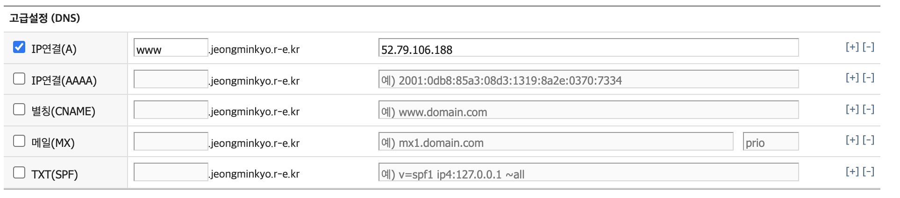

## AWS를 이용하여 서비스 구성하기 2주차

#### EC2 생성하기

- **서버 생성시 발급받은 key를 분실할 경우 서버에 접속할 수 없으므로 key를 분실하지 않도록 주의**

- 서버는 사용하지 않는 경우 STOP.

- 서버는 2개 생성. bastion server 1개. api server 1개.


|                    | api         | bastion     |
| ------------------ | ----------- | ----------- |
| AMI                | ubuntu18.04 | ubuntu18.04 |
| 서브넷             | 외부망      | 관리망      |
| 보안그룹           | http        | ssh         |
| 퍼블릭 IP 자동할당 | 활성화      | 활성화      |


#### 서버에 접속하기


##### 윈도우즈 운영체제 사용자

- [PuTTY를 사용하여 Windows에서 Linux 인스턴스에 연결](https://docs.aws.amazon.com/ko_kr/AWSEC2/latest/UserGuide/putty.html)
- [putty를 위한 ppk 생성](https://klero.tistory.com/entry/AWS-EC2-사용-pem키-ppk로-변환하여-Putty-SSH-접속방법)


##### 서버간 SSH 연결

ssh key를 생성한다.

```bash
[Bastion]
ssh-keygen -t rsa
cat ~/.ssh/id_rsa.pub
```

접속하려는 서비스용 서버에 키를 추가한다.

```bash
[API]
vi ~/.ssh/authorized_keys
```

접속 확인.

```bash
[Bastion]
## api server에서 접속
ssh ubuntu@[서비스용 서버 IP]
```

접속을 편하게 하기 위한 alias 설정.

```bash
vi /etc/hosts
[서비스용IP]    [별칭]
```


#### 서버 설정 해보기

##### shell prompt 변경하기

Bastion 등 구분해야 하는 서버의 Shell Prompt를 설정하여 관리자의 인적 장애를 예방할 수 있다.

- [쉘변수](https://webdir.tistory.com/105)
- [PS1 generator](http://ezprompt.net/)

```bash
[Bastion]
vi ~/.bashrc

SERVER=BASTION
PS1='[\e[1;31m$SERVER\e[0m][\e[1;32m\t\e[0m][\e[1;33m\u\e[0m@\e[1;36m\h\e[0m \w] \n\$ \[\033[00m\]'

source ~/.bashrc
```


```bash
[API]
vi ~/.bashrc

SERVER=public
PS1='[\e[1;31m$SERVER\e[0m][\e[1;32m\t\e[0m][\e[1;33m\u\e[0m@\e[1;36m\h\e[0m \w] \n\$ \[\033[00m\]'

source ~/.bashrc
```


##### java 설치

```bash
sudo apt update
sudo apt install default-jre
sudo apt install default-jdk
```


##### 소스코드 빌드

```bash
git clone https://github.com/next-step/infra-subway-deploy.git
cd infra-subway-deploy
./gradlew clean build -x test
```


##### 서버기동

```bash
nohup java -Djava.security.egd=file:/dev/./urandom -jar build/libs/subway-0.0.1-SNAPSHOT.jar 1> application.log 2>&1  &
```

브라우저에서 `http://{서버 ip}:{port}`로 접근.


#### DNS 설정

[무료 도메인 사이트](https://xn--220b31d95hq8o.xn--3e0b707e/) 들을 활용하여 DNS 설정을 한다.

사이트 회원가입 후, 등록하려는 도메인 입력.







ip연결에 public ip 주소 연결.



#### WEB SERVER VS WAS SERVER


#### Reverse Proxy 


WAS는 정적 이미지나 정적 파일, TLS와 같은 부수적인 기능으로 애플리케이션에 직접 영향을 주지 않고 비즈니스 로직만 담당하는게 좋다. 그럴 때 이러한 역할들을 해줄 대행자(proxy)가 필요한데, Reverse Proxy가 그 역할을 수행한다.

**Reverse Proxy**는 클라이언트로부터의 요청을 받아서(필요하다면 주위에서 처리한 후) 적절한 웹 서버로 요청을 전송한다. 웹 서버는 요청을 받아서 평소처럼 처리를 하지만, 응답을 클라이언트로 보내지 않고 Reverse Proxy로 반환한다. 요청을 받은 Reverse Proxy는 그 응답을 클라이언트로 반환한다.


#### Reverse Proxy와 Load Balancer의 차이점

https://ssungkang.tistory.com/entry/DevOps-Reverse-Proxy-vs-Load-Balancer-%EB%A6%AC%EB%B2%84%EC%8A%A4-%ED%94%84%EB%A1%9D%EC%8B%9C-vs-%EB%A1%9C%EB%93%9C-%EB%B2%A8%EB%9F%B0%EC%84%9C


nginx는 Reverse Proxy, Load Balancer 두가지 역할을 수행할 수 있다.


##### 도커 설치

```sh
$ sudo apt-get update && \
sudo apt-get install -y apt-transport-https ca-certificates curl software-properties-common && \
curl -fsSL https://download.docker.com/linux/ubuntu/gpg | sudo apt-key add - && \
sudo apt-key fingerprint 0EBFCD88 && \
sudo add-apt-repository "deb [arch=amd64] https://download.docker.com/linux/ubuntu $(lsb_release -cs) stable" && \
sudo apt-get update && \
sudo apt-get install -y docker-ce && \
sudo usermod -aG docker ubuntu && \
sudo curl -L "https://github.com/docker/compose/releases/download/1.23.2/docker-compose-$(uname -s)-$(uname -m)" -o /usr/local/bin/docker-compose && \
sudo chmod +x /usr/local/bin/docker-compose && \
sudo ln -s /usr/local/bin/docker-compose /usr/bin/docker-compose
```


##### Dockerfile

```sh
FROM nginx

COPY nginx.conf /etc/nginx/nginx.conf  
```


##### nginx.conf

```sh
events {}

http {
  upstream app {
    server 172.17.0.1:8080;
  }

  server {
    listen 80;

    location / {
      proxy_pass http://app;
    }
  }
}
$ docker build -t nextstep/reverse-proxy .
$ docker run -d -p 80:80 nextstep/reverse-proxy
```


#### TLS 설정

평문으로 통신할 경우, 패킷을 스니핑할 수 있기 때문에 서버의 보안과 별개로 서버와 클라이언트간 통신상의 암호화가 필요하다.

[letsencrypt](https://letsencrypt.org/ko/)를 활용하여 무료로 TLS 인증서를 사용할 수 있다.

```sh
$ docker run -it --rm --name certbot \
  -v '/etc/letsencrypt:/etc/letsencrypt' \
  -v '/var/lib/letsencrypt:/var/lib/letsencrypt' \
  certbot/certbot certonly -d 'yourdomain.com' --manual --preferred-challenges dns --server https://acme-v02.api.letsencrypt.org/directory
```

인증서 생성 후 유효한 URL인지 확인을 위해 DNS TXT 레코드로 추가한다.


우선 인증서를 현재 경로로 옮긴다.

```sh
cp /etc/letsencrypt/live/[도메인주소]/fullchain.pem ./
cp /etc/letsencrypt/live/[도메인주소]/privkey.pem ./
```


Dockerfile 을 아래와 같이 수정.

```sh
FROM nginx

COPY nginx.conf /etc/nginx/nginx.conf 
COPY fullchain.pem /etc/letsencrypt/live/[도메인주소]/fullchain.pem
COPY privkey.pem /etc/letsencrypt/live/[도메인주소]/privkey.pem
```


nginx.conf 파일을 아래와 같이 수정.

```sh
events {}

http {       
  upstream app {
    server 172.17.0.1:8080;
  }
  
  # Redirect all traffic to HTTPS
  server {
    listen 80;
    return 301 https://$host$request_uri;
  }

  server {
    listen 443 ssl;  
    ssl_certificate /etc/letsencrypt/live/[도메인주소]/fullchain.pem;
    ssl_certificate_key /etc/letsencrypt/live/[도메인주소]/privkey.pem;

    # Disable SSL
    ssl_protocols TLSv1 TLSv1.1 TLSv1.2;

    # 통신과정에서 사용할 암호화 알고리즘
    ssl_prefer_server_ciphers on;
    ssl_ciphers ECDH+AESGCM:ECDH+AES256:ECDH+AES128:DH+3DES:!ADH:!AECDH:!MD5;

    # Enable HSTS
    # client의 browser에게 http로 어떠한 것도 load 하지 말라고 규제합니다.
    # 이를 통해 http에서 https로 redirect 되는 request를 minimize 할 수 있습니다.
    add_header Strict-Transport-Security "max-age=31536000" always;

    # SSL sessions
    ssl_session_cache shared:SSL:10m;
    ssl_session_timeout 10m;      

    location / {
      proxy_pass http://app;    
    }
  }
}
```


방금전에 띄웠던 도커 컨테이너를 중지 & 삭제하고 새로운 설정을 반영한다.

```plaintext
$ docker stop proxy && docker rm proxy
$ docker build -t nextstep/reverse-proxy:0.0.2 .
$ docker run -d -p 80:80 -p 443:443 --name proxy nextstep/reverse-proxy:0.0.2
```

