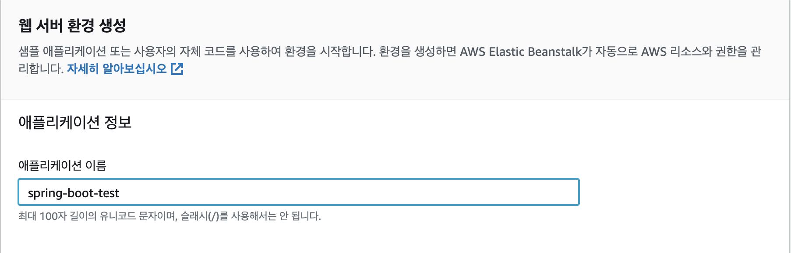

## AWS를 이용하여 서비스 구성하기 2주차

#### Elastic Beanstalk

웹 어플리케이션/웹 서비스를 배포하고, 확장하고, 관리하는데 있어 쉽고 빠르게 할 수 있도록 돕는 완전 관리형 서비스이다.

Elastic Beanstalk는 Java, Go, PHP, .NET, Node.js, Python, Ruby 등으로 개발된 앱을 지원하고 각 플랫폼마다 다양한 구성을 지원한다.


#### AWS Elastic Beanstalk 장점

###### **빠르고 간편한 시작**

Elastic Beanstalk는 AWS에 애플리케이션을 배포하는 가장 빠르면서 간편한 방법이다. 애플리케이션을 업로드하기만 하면 Elastic Beanstalk가 용량 프로비저닝, 로드밸런싱, Auto Scaling, 애플리케이션 상태 모니터링에 대한 배포 정보를 자동으로 처리합니다.몇 분 안에 애플리케이션을 사용할 수 있다. 인프라나 리소스를 구성할 필요가 전혀 없다.

###### **적절한 규모 유지**

Elastic Beanstalk는 손쉽게 조정할 수 있는 Auto Scaling 설정을 사용하여 애플리케이션의 특정한 필요에 따라 자동으로 애플리케이션을 확장하거나 축소할 수 있다. 예를 들어, CPU 사용률 지표를 참조하여 Auto Scaling 작업을 트리거 할 수 있다. Elastic Beanstalk를 사용하면 애플리케이션 비용을 최소화하면서 피크 워크로드나트래픽를처리할 수 있다.

###### **개발자 생산성**

Elastic Beanstalk는 사용자 대신 인프라를 프로비저닝하고운영할 뿐만 아니라 애플리케이션 스택(플랫폼)을 관리해주므로,사용자는 시간을 따로 들이거나 익숙해지기 위해 애쓸 필요가 없다. 또한, 애플리케이션이 실행되는 기본 플랫폼을 최신 패치와 업데이트를 통해 최신 상태로 유지한다.서버,데이터베이스, 로드밸런서,방화벽,네트워크 등을 관리하고 구성하는 데 시간을 들이는 대신 코드 작성에 집중할 수 있다.

###### **완벽한 리소스 제어**

Amazon EC2 인스턴스 유형 등 애플리케이션에 가장 적합한 AWS 리소스를 자유롭게 선택할 수 있다. 또한, Elastic Beanstalk를 사용하면 애플리케이션을 실행하는 데 필요한 AWS 리소스를 파악하여 완벽하게 제어할 수 있다. 인프라 요소 중 일부(또는 전체)를 손쉽게 제어하려면 Elastic Beanstalk의 관리 기능을 사용하면 된다.


#### Elastic Beanstalk 시작하기

1. ##### 기존 소스코드 build

   LandvibeDev에 infra-subway-deploy 소스코드(https://github.com/LandvibeDev/infra-subway-deploy) 

   로컬 컴퓨터에 git clone.

   ```bash
   git clone https://github.com/LandvibeDev/infra-subway-deploy.git
   ```

   디렉토리 이동

   ```bash
   cd infra-subway-deploy
   ```

   소스코드 빌드

   ```bash
   ./gradlew clean build -x test
   ```

   빌드파일 확인

   ```bash
   ls build/libs
   ```

   subway-0.0.1-SNAPSHOT.jar 해당 파일이 있는지 확인.

   

2. ##### beanstalk 생성

   Beanstalk 검색

   

   

   새 환경 생성

   

   

   웹 서버 환경 선택.

   - 웹 서버 환경
     - 기존에 EC2를 사용하던 방식과 크게 다르지 않습니다.
     - 일반적인 웹 서버를 할당 받을 때 사용하면 됩니다.
   - 작업자 환경 (Worker environments)
     - 웹 서버 환경에 **메세지 큐 (SQS) 수신이 가능한 리스너 데몬**이 별도 구축된 환경 입니다.
     - 보통의 HTTP API 처리가 아닌 프로세스들(배치/메시지워커 등)을 위한 환경입니다.
     - [참고](https://docs.aws.amazon.com/ko_kr/elasticbeanstalk/latest/dg/using-features-managing-env-tiers.html)

   

   

   적당한 이름으로 생성.

   

   

   자동 기입

   

   

   관리형 플랫폼을 선택하여 **Java 8** 을 선택

   [Corretto](https://aws.amazon.com/ko/corretto/) 란 AWS에서 지원하는 무료로 사용할 수 있는 Open Java Development Kit(OpenJDK)의 멀티플랫폼 배포판.

   

   

   추가 옵션 구성을 통해 추가 구성을 설정.

   

   

   네트워크 설정 클릭

   LB와 인스턴스는 public subnet에 생성되도록 설정

   

   

   

   사용자 지정 구성 클릭

   

   

   인스턴스 클릭. 보안 그룹은 http, ssh가 열린 보안 그룹을 선택.

   

   

   

   용량 클릭, 용량은 오토스케일링 그룹을 이야기함. 즉, 이 Beanstalk으로 운영될 인스턴스의 수를 몇대로 할 것인지 정함.

   프리티어로 사용할거기 때문에 1대로 유지.

   


로드밸런서 선택.  다양한 라우팅 기능을 지원하는 ALB를 선택.


롤링 업데이트는 이 후, 다음 주 배포때 사용할 예정.


보안설정은 인스턴스 접속가능한 pem을 설정. 지난주에 만들었던 키 페어 선택.


생성 클릭 후 시간이 지나면 beanstalk이 생성됨.


상태가 success가 되면 해당 도메인으로 클릭하면 서비스 접근 가능.

