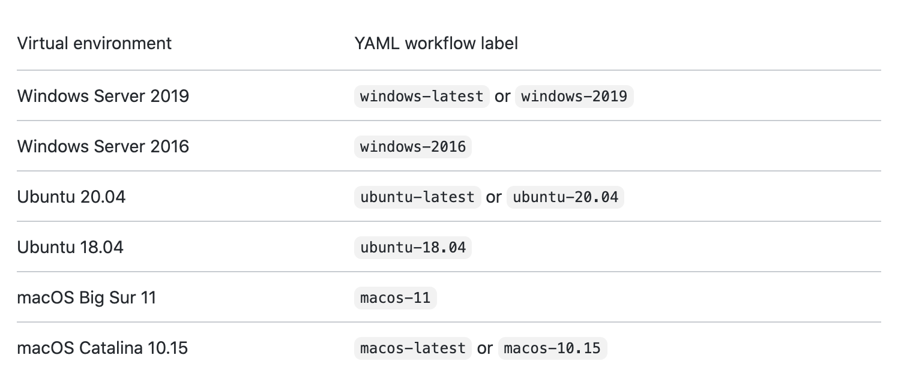
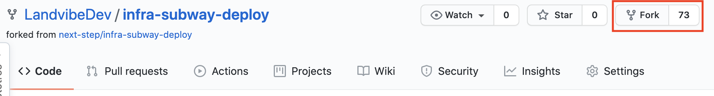
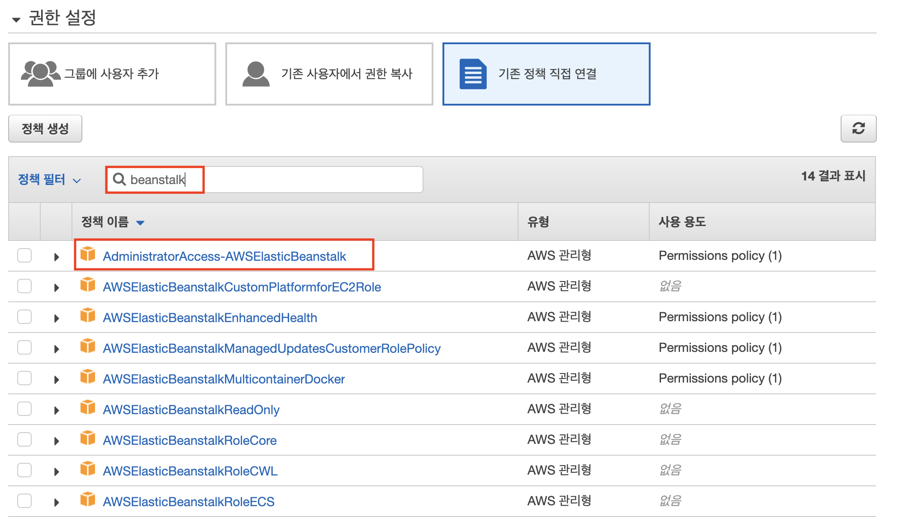
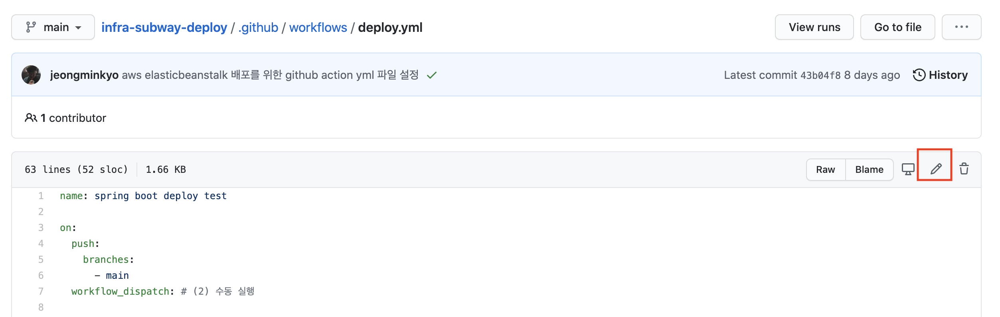

## AWS를 이용하여 서비스 구성하기 4주차

#### Deploy Strategy

##### 1. Blue Green

구 버전에서 새 버전으로 일제히 전환하는 전략이다. 구 버전의 서버와 새 버전의 서버들을 동시에 나란히 구성하고 배포 시점이 되면 트래픽을 일제히 전환시킨다. 

- 장점
  - 하나의 버전만 프로덕션 되므로 버전 관리 문제를 방지할 수 있다. 
  - 빠른 롤백이 가능하다.
  - 운영 환경에 영향을 주지 않고 실제 서비스 환경으로 새 버전 테스트가 가능
- 단점
  - 인프라 리소스가 2배로 들어간다.
  - 기존 운영되고 있는 서버에서 Long-term 트랜잭션이 수행중이었다면 전환시 어떤 방식으로 처리할 지 충분한 고려가 필요하다.


##### 2. Rolling Update

Rolling 배포는 서버를 한 대씩 구 버전에서 새 버전으로 교체해가는 전략이다. 서비스 중인 서버 한 대를 제외시키고 그 자리에 새 버전의 서버를 추가한다. 이렇게 구 버전에서 새 버전으로 트래픽을 점진적으로 전환한다.

- 장점
  -  서버 수의 제약이 있을 경우 유용
- 단점
  - 구 버전과 신 버전이 공존하는 시기가 있으므로, 두 버전을 모두 고려하여 개발해야 한다.(e.g., DB schema)
  - 배포 중 인스턴스의 수가 감소 되므로 서버 처리 용량을 미리 고려


##### 3. Canary

'Canary'라는 용어의 어원을 알면 이해가 더 쉽다. Canary는 카나리아 라는 새를 일컫는 말인데, 이 새는 일산화탄소 및 유독가스에 매우 민감하다고 한다. 그래서 과거 광부들이 이 새를 옆에 두고 광산에서 일을 하다가 카나리아가 갑자기 죽게 되면 대피를 했다고 한다.

Canary 배포는 카나리아 새처럼 위험을 빠르게 감지할 수 있는 배포 기법이다. 구 버전의 서버와 새 버전의 서버들을 구성하고 일부 트래픽을 새 버전으로 분산하여 오류 여부를 판단한다. 

- 장점
  - A/B 테스트도 가능한데, 오류율 및 성능 모니터링에 유용
  -  트래픽을 분산시킬 라우팅은 랜덤으로 할 수도 있고 사용자 프로필 등을 기반으로 분류할 수도 있다. 분산 후 결과에 따라 새 버전이 운영 환경을 대체할 수도 있고, 다시 구 버전으로 돌아가 수도 있다.
- 단점
  - 동시에 여러개의 소프트웨어 버전을 관리해야 한다는 점.


#### Github Action

> GitHub Actions를 사용하여 리포지토리에서 바로 소프트웨어 개발 워크플로를 자동화, 사용자 지정 및 실행합니다. CI/CD를 포함하여 원하는 작업을 수행하기 위한 작업을 검색, 생성 및 공유하고 완전히 사용자 정의된 워크플로에서 작업을 결합할 수 있습니다.
>
> _github action 공식페이지_

Workflow는 Github 저장소에서 발생하는 build, test, package, release, deploy 등 다양한 이벤트를 기반으로 직접 원하는 Workflow를 만들 수 있다.


#### 얼마나 사용 할 수 있을까?

Workflow는 저장소마다 최대 20개까지 등록할 수 있다. 그리고 Workflow 안에 존재하는 `Job`이라는 단계마다 최대 6시간 동안 실행될 수 있고, 초과하게 되면 자동으로 중지된다.

그리고 Github 계정 플랜에 따라 전체 Git 저장소를 통틀어 동시 실행할 수 있는 `Job` 개수가 정해져 있다.
Job 안에서 Github API를 호출한다면 1시간 동안 최대 1,000번까지만 가능하다.


#### 사용료 얼마나?

공개 저장소는 무료이며, 비공개 저장소는 해당 계정에 부여된 무료 사용량 이후에 과금된다.
Github 무료 계정의 전체 비공개 저장소를 기준으로 한달에 500MB 스토리지와 실행 시간 2,000분(minute)까지 제공된다.


#### Workflow 시작하기

기본적인 방법은 저장소에 `.github/workflows` 폴더를 만들어서 `.yml` 형식 파일 만든 뒤 Workflow를 정의하는 것이다.


#### Workflow 주요 구성

- 어떤 이벤트가 발생했을 때 실행될 수 있다.
- 최소 1개 이상의 **Job**을 정의해야 한다.
- Job 안에는 여러 **Step**을 정의할 수 있다.
- Step 안에는 단순한 커맨드 실행이나 **Action**을 가져와 사용할 수 있다.
- Action은 Github 마켓플레이스에 공유된 Action을 이용하거나 현재 저장소에서 직접 만들어서 사용할 수 있다.


Github Action 플러그인은 [Beanstalk Deploy](https://github.com/marketplace/actions/beanstalk-deploy) 을 이용하여 EB에 배포한다. 해당 플러그인을 사용할 경우 아래와 같이 설정값만 채워주면 편하게 배포 코드를 작성할 수 있으니 이를 사용한다.

```yaml
name: spring boot deploy test

on:
  push:
    branches:
      - main # (1)
  workflow_dispatch: # (2) 수동 실행

jobs:
  build:
    runs-on: ubuntu-latest # (3)

    steps:
      - name: Checkout
        uses: actions/checkout@v2 # (4)

      - name: Set up JDK 1.8
        uses: actions/setup-java@v1 # (5)
        with:
          java-version: 1.8

      - name: Install Packages 
        run: cd frontend && npm install # (6)
        shell: bash

      - name: Gnerate Bundle File 
        run: cd frontend && npm run prod #(7)
        shell: bash

      - name: Grant execute permission for gradlew
        run: chmod +x ./gradlew # (8)
        shell: bash

      - name: Build with Gradle
        run: ./gradlew clean build # (9)
        shell: bash

      - name: Get current time
        uses: 1466587594/get-current-time@v2 # (10)
        id: current-time
        with:
          format: YYYY-MM-DDTHH-mm-ss
          utcOffset: "+09:00"

      - name: Generate deployment package # (11)
        run: |
          mkdir -p deploy
          cp build/libs/*.jar deploy/application.jar
          cp Procfile deploy/Procfile
          cp -r .ebextensions deploy/.ebextensions
          cp -r .platform deploy/.platform
          cd deploy && zip -r deploy.zip .
      - name: Deploy to EB # (11)
        uses: einaregilsson/beanstalk-deploy@v17
        with:
          aws_access_key: ${{ secrets.AWS_ACCESS_KEY_ID }}
          aws_secret_key: ${{ secrets.AWS_SECRET_ACCESS_KEY }}
          application_name: test
          environment_name: Test-env
          version_label: github-action-${{steps.current-time.outputs.formattedTime}}
          region: ap-northeast-2
          deployment_package: deploy/deploy.zip
```

(1) `on: push: branches: - main`

- 현재 만드는 Github Action의 **트리거 브랜치**를 지정한다.

(2) `on: workflow_dispatch:`

- 브랜치 push 이벤트외에, **수동으로 실행**하는 것도 가능하게 만드는 옵션이다.

(3) `jobs: build: runs-on: ubuntu-latest`

- 해당 Github Action 스크립트가 작동될 [OS 환경](https://docs.github.com/en/actions/reference/workflow-syntax-for-github-actions#jobsjob_idruns-on)을 지정한다.

  

(4) `uses: actions/checkout@v2`

- 프로젝트 코드를 checkout 한다.

(5) `actions/setup-java@v1`

- Github Action이 실행될 OS에 Java를 설치한다.
- `with: java-version: 1.8` 로 메이저 버전을 설치할 수 있으며 11, 13 등 버전들도 설치 가능하며,  자세한건 [마켓플레이스 Action](https://github.com/marketplace/actions/setup-java-jdk)을 참고하면 된다.

(6) `cd frontend && npm install`

- 화면 view쪽인 vue의 의존성을 설치하기 위해 npm install을 수행.

(7) `cd frontend && npm run prod`

- vue 생성 산출물을 정적파일에 추가하기 위한 작업.

(8) `run: chmod +x ./gradlew`

- gradle wrapper를 실행할 수 있도록 실행 권한 (`+x`)을 부여하여,아래 (7) 를 실행할 수 있도록 한다.

(9) `run: ./gradlew clean build`

- gradle wrapper를 통해 해당 프로젝트를 build 한다.

(10) `with: format: YYYY-MM-DDTHH-mm-ss`

- `1466587594/get-current-time` action의 경우 기존의 [Momentjs](https://momentjs.com/docs/#/displaying/format/)을 지원하기 때문에 동일한 포맷을 사용하면 된다.
- `utcOffset: "+09:00"`: 해당 action의 기준이 UTC이기 때문에 한국시간이 KST를 맞추기 위해서는 +9시간이 필요하여 offset을 추가한다.

(11) 

- Gradle Build를 통해 만들어진 jar 파일을 Beanstalk에 배포하기 위한 zip 파일로 만들어줄 스크립트.
- 빌드가 끝나면 해당 배포 Jar의 파일명을 `application.jar`로 교체. 매 빌드때마다 jar의 파일명이 버전과 타임스탬프로 파일명이 교체되므로 배포시에 매번 달라질 파일명을 찾아내기 보다는 하나로 통일해서 사용하도록 변경.
- application.jar 외에 3개의 파일/디렉토리 `Procfile`, `.ebextensions`, `.platform` 도 함께 zip에 포함.

(12)

- Beanstalk 플러그인을 사용하는 코드.
- 미리 생성해둔 IAM 인증키를 사용.
- [이전 시간](https://jojoldu.tistory.com/543) 에 만들어준 **현재 시간** 플러그인을 통해 Beanstalk이 배포될때마다 유니크한 버저닝이 될 수 있도록 `github-action-${{steps.current-time.outputs.formattedTime}}` 코드를 추가.


#### 프로젝트 구성

1. `.ebextensions`
   Beanstalk은 시스템의 대부분을 AWS에서 자동으로 구성해주기 때문에 기존 EC2에 직접 설치할때처럼 사용할 순 없어서 직접 Custom 하게 사용할 수 있도록 설정할 수 있는 방법이 바로 `.ebextensions` 디렉토리.

   해당 디렉토리에 `.config` 파일 확장명을 가진 YAML이나 JSON 형태의 설정 코드를 두면 그에 맞춰 Beanstalk 배포시/환경 재구성시 사용하게 된다.

   **.ebextensions/00-makeFiles.config**

   ```
   files:
       "/sbin/appstart" :
           mode: "000755"
           owner: webapp
           group: webapp
           content: |
               #!/usr/bin/env bash
               JAR_PATH=/var/app/current/application.jar
   
               # run app
               killall java
               java -Dfile.encoding=UTF-8 -jar $JAR_PATH
   ```

   - `/sbin` 아래에 스크립트 파일을 두면 **전역에서 실행 가능**
   - 그래서 `/sbin` 아래에 `appstart`란 이름의 스크립트 파일을 만들고, 권한은 `755`, 사용자는 `webapp`으로 하여 `content` 내용을 가진 스크립트 파일이 생성.
   - 여기서 만들어진 `/sbin/appstart` 스크립트 파일이 Procfile에서 실행.

   > `.ebextensions` 의 `config`에 대한 상세한 설명은 [우아한형제들의 기술 블로그](https://woowabros.github.io/woowabros/2017/08/07/ebextension.html)를 참고.

2. `Procfile`
   Beanstalk은 배포 파일을 전달 받고나면 `.ebextensions`를 비롯한 각종 설정파일들을 실행한 뒤에, 애플리케이션 실행 단계를 거치는데, 이때 애플리케이션 실행 단계때 하는 행위는 이 Procfile을 실행하는 것이다. 위에서 `.ebextensions/00-makeFiles.config` 으로 만들어진 `/sbin/appstart` 스크립트를 실행하도록 코드를 구성한다**Procfile**

   ```
   web: appstart
   ```

3. `./platform/nginx`

마지막으로 리버스 프록시를 담당할 Nginx 설정을 한다. 이 시리즈에서는 **로드밸런서** (ALB) 가 무중단 배포 역할을 대신 하기 때문에 Nginx에서는 단순히 **임베디드 톰캣으로 요청을 보내는 역할**만 할 예정.

**.platform/nginx/nginx.conf**

```vim
user                    nginx;
error_log               /var/log/nginx/error.log warn;
pid                     /var/run/nginx.pid;
worker_processes        auto;
worker_rlimit_nofile    33282;

events {
    use epoll;
    worker_connections  1024;
}

http {
  include       /etc/nginx/mime.types;
  default_type  application/octet-stream;

  log_format  main  '$remote_addr - $remote_user [$time_local] "$request" '
                    '$status $body_bytes_sent "$http_referer" '
                    '"$http_user_agent" "$http_x_forwarded_for"';

  include       conf.d/*.conf;

  map $http_upgrade $connection_upgrade {
      default     "upgrade";
  }

  upstream springboot {
    server 127.0.0.1:5000;
    keepalive 1024;
  }

  server {
      listen        80 default_server;

      location / {
          proxy_pass          http://springboot;
          proxy_http_version  1.1;
          proxy_set_header    Connection          $connection_upgrade;
          proxy_set_header    Upgrade             $http_upgrade;

          proxy_set_header    Host                $host;
          proxy_set_header    X-Real-IP           $remote_addr;
          proxy_set_header    X-Forwarded-For     $proxy_add_x_forwarded_for;
      }

      access_log    /var/log/nginx/access.log main;

      client_header_timeout 60;
      client_body_timeout   60;
      keepalive_timeout     60;
      gzip                  off;
      gzip_comp_level       4;

      # Include the Elastic Beanstalk generated locations
      include conf.d/elasticbeanstalk/healthd.conf;
  }
}
```


#### 실습

1. https://github.com/LandvibeDev/infra-subway-deploy를 개인 repo로 fork.

   

2. IAM 인증키 발급받기

   

   

   

   

   

   Github 페이지로 이동 > Github 에서 상단 탭을 보시면 **Settings ** > 좌측 사이드바의 **Secrets** -> **New Repository secret** 버튼을 차례로 클릭.

   

   

3. .github/workflows/deploy.yml로 이동.

   

4. 수정 버튼 클릭

   

5. 설정 파일 수정

   - name : 알아서 적절한 명으로 수정

   - Deploy to EB에 application_name : EB에서 생성했던 애플리케이션 이름
   - Deploy to EB에 environment_name : EB에서 생성했던 환경 이름

6. infra-subway-deploy/frontend/src/views/main/MainPage.vue 내용 수정

7. main branch에 commit push.

8. github action 동작 확인


------

[참고]

https://jojoldu.tistory.com/549?category=777282

https://onlywis.tistory.com/10

https://poikilo.github.io/2020/03/03/deployment-strategy/